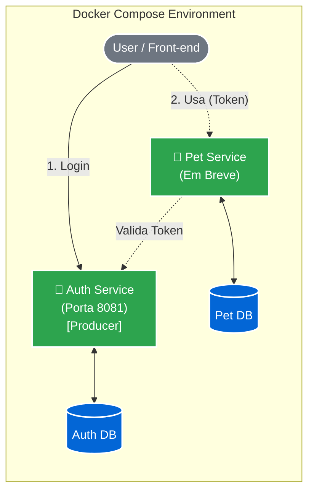

# 🐾 Sistema de Microsserviços - Pet Shop & Auth

---


Este projeto é um sistema distribuído baseado em **microsserviços** para gerenciamento de um **Pet Shop**. O objetivo é demonstrar uma arquitetura robusta, segura e escalável utilizando Java e Docker.

## 🏛️ Arquitetura do Sistema

O sistema segue o padrão de **Arquitetura de Microsserviços**, onde a autenticação é desacoplada das regras de negócio.


## 🚀 Tecnologias & Patterns
* **Core:** Java 21, Spring Boot 3.4+

* **Mensageria:** RabbitMQ (AMQP), Topic Exchange.

* **Segurança:** Spring Security, JWT (Access + Refresh Token), BCrypt (Cost 12), Google Guava (Blacklist).

* **Infraestrutura:** Docker, Docker Compose.

* **Banco de Dados:** PostgreSQL 15.

* **Documentação:** Swagger/OpenAPI (/swagger-ui.html).

* **Qualidade:** Tratamento de XSS (Sanitização de HTML), Validação de Fingerprint (IP/User-Agent).

---

## 🏛️ Arquitetura dos Serviços

### 1. 🔐 Auth Service (Rodando)
Responsável pela identidade e segurança de todo o ecossistema.
* **Porta:** `8081`
* **Features:**
    * Autenticação via **JWT (Access + Refresh Token)**.
    * Recuperação de Senha via **E-mail (Token temporário)**.
    * Sistema de **Blacklist** para Logout seguro.
    * Senhas criptografadas com **BCrypt**.
    * Proteção contra **XSS (Cross-Site Scripting)** usando sanitização de HTML.
    * Validação de **Fingerprint** no token.

## 2. 📨 Mail Service (Consumer)
   Responsável pelo envio de notificações transacionais.

* **Porta:** `8082`

* **Features:** Ouve a fila auth.v1.password-reset.send-email e dispara e-mails via SMTP (Mailtrap).

* **Resiliência:** Configurado com Retries Automáticos e Dead Letter Queue (DLQ). 

## 3. 🐰 RabbitMQ (Broker)
   O coração da comunicação assíncrona.

* **Porta AMQP:** `5672`

* **Dashboard:** `15672` 

### 4. 🐾 Pet Service (Próximo Passo)
Responsável pelo core business (regras de negócio).
* **Porta:** `8082` (Previsto)
* **Funcionalidades:** Cadastro de pets, agendamento de serviços (banho/tosa).

---

## 🛠️ Como Rodar o Projeto

### Pré-requisitos
* Docker e Docker Compose instalados.
* Java 21 (Opcional, apenas se quiser rodar fora do Docker).

### Passo a Passo

1.  **Clone o repositório:**
    ```bash
    git clone [https://github.com/SEU-USUARIO/SEU-REPO.git](https://github.com/SEU-USUARIO/SEU-REPO.git)
    cd petshop-microservices
    ```

2.  **Gere os executáveis (.jar):**
    * No IntelliJ: Aba Maven > `auth-service` > `Lifecycle` > `clean` e `package`.
    * Ou via terminal na pasta do serviço:
        ```bash
        cd apps/auth-service
        ./mvnw clean package
        ```

3.  **Suba os containers:**
    Na raiz do projeto (onde está o `docker-compose.yml`):
    ```bash
    docker-compose up --build
    ```

4.  **Acesse a Documentação (Swagger):**
    * Auth Service: [http://localhost:8081/swagger-ui.html](http://localhost:8081/swagger-ui.html)
    * RabbitMQ Dash: [http://localhost:15672](http://localhost:15672) (usuário: `guest`, senha: `guest`)

---

## 🧪 Payloads para Teste (JSON)

### 1. Registrar Usuário (POST /usuarios/register)
**Segurança:** A senha deve ter min 8 caracteres, maiúscula, minúscula, número e especial.
```json
{
  "nome": "Seu Nome",
  "email": "teste@email.com",
  "senha": "SenhaForte123!"
}
```

### 2. Login (POST /usuarios/login)
```json
{
  "email": "teste@email.com",
  "senha": "SenhaForte123!"
}
```
### 3. Refresh Token (POST /usuarios/refresh-token)
```json
{
  "refreshToken": "COLE_O_TOKEN_DE_REFRESH_AQUI"
}
```

### 4. Logout (POST /usuarios/logout)
```json
{
  "refreshToken": "COLE_O_TOKEN_DE_REFRESH_AQUI"
}
```

### 5. Recuperar Senha - Solicitação (POST /usuarios/forgot-password)
```json
{
  "email": "teste@email.com"
}
```

### 6. Recuperar Senha - Reset (POST /usuarios/reset-password)
```json
{
  "token": "COLE_O_TOKEN_RECEBIDO_NO_EMAIL",
  "newPassword": "NovaSenhaForte123!"
}
```

## 📂 Estrutura do Projeto
```
petshop-microservices/
├── apps/
│   ├── auth-service/       # Microsserviço de Autenticação
│   │   ├── src/main/java/auth/
│   │   │   ├── config/     # SecurityConfig
│   │   │   ├── controller/ # Endpoints
│   │   │   ├── security/   # Lógica JWT e Filtros
│   │   │   └── service/    # Regras de Negócio
│   │   └── Dockerfile
│   │
│   ├── mail-service/       # [Consumer] Envio de E-mails
│   │   ├── src/main/java/mail/service/EmailConsumer.java
│   │   └── Dockerfile
│   │
│   └── pet-service/        # (Em construção...)
│
└── docker-compose.yml      # Orquestração dos containers
```

## 🗺️ Roadmap (Próximos Passos)
```
[x] Auth Service: Login, Registro, JWT, Refresh Token, Logout.

[x] Segurança: Criptografia de senhas, proteção XSS e Recuperação de Senha.

[x] Docker: Containerização do Banco e API.

[x] Mensageria: Integração com RabbitMQ (Producer/Consumer).

[x] Resiliência: Implementação de DLQ (Dead Letter Queue) e Retries.

[x] Mail Service: Microserviço dedicado para notificações.

[ ] Pet Service: CRUD de Pets e vínculo com usuário logado.

[ ] Agendamento: Lógica de horários para Banho e Tosa.

[ ] Front-end: Interface em React.
```

## 📄 Licença

Este projeto está sob a licença MIT - veja o arquivo [LICENSE](LICENSE) para detalhes.

---

## 📬 Contato
Gostou do projeto? Entre em contato!

* **LinkedIn:** https://www.linkedin.com/in/gabriel-tanaka-b1669b175/

* **Email:** gabrielferraritanaka@gmail.com