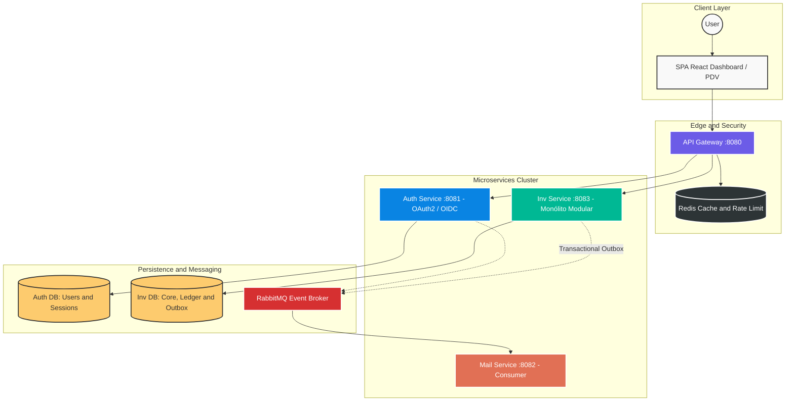

# 🐾 Sistema de Microsserviços - Pet Shop & Auth

---


Este projeto é um sistema distribuído empresarial para gerenciamento de um **Pet Shop & PDV**, combinando **Microsserviços de Borda/Segurança** (`api-gateway`, `auth-service`, `mail-service`) com um **Monólito Modular orientado a DDD** no núcleo de negócio (`inv-service`: Checkout, Financeiro e Estoque).

---

## 🏛️ Hub Central de Documentação Técnica

Toda a arquitetura, regras de negócio e decisões de engenharia estão catalogadas na pasta [`docs/`](docs):

### 📚 Guias Arquiteturais e de Domínio
* 🏛️ **[Visão Geral do Sistema (C4 Containers & Migrações)](docs/architecture/system-overview.md)**
* 💰 **[Motor Financeiro & Contábil (Ledger Append-Only, CQRS e D+0)](docs/domains/finance.md)**
* 🛒 **[Domínio de Checkout (Máquinas de Estado, Webhooks e Long Polling)](docs/domains/checkout.md)**
* 📦 **[Domínio de Inventário (Estoque Atômico e Alertas Anti-Spam)](docs/domains/inventory.md)**
* 🔐 **[Segurança & Gestão de Identidade (OIDC, RSA e Rate Limiting)](docs/domains/security.md)**

---

## 📑 Catálogo de Decisões de Arquitetura (ADRs)

| ID | Título do ADR | Status | Bounded Contexts | Destaque Técnico |
| :--- | :--- | :--- | :--- | :--- |
| **[ADR-0001](docs/adr/0001-modular-monolith-bounded-contexts.md)** | Monólito Modular com Bounded Contexts | `Aceito` | Core / Inv-Service | Eliminação de nano-serviços e redução de latência no PDV. |
| **[ADR-0002](docs/adr/0002-atomic-sql-inventory-and-hybrid-locking.md)** | Controle Híbrido de Concorrência & Estoque Atômico | `Aceito` | Inventory, Checkout | `UPDATE ... RETURNING`, `@Retryable` e Lock Pessimista na Liquidação. |
| **[ADR-0003](docs/adr/0003-async-long-polling-pos-deferred-result.md)** | Long Polling Não-Bloqueante com `DeferredResult` | `Aceito` | Checkout | *Request Parking* assíncrono para PDV aguardando Webhooks. |
| **[ADR-0004](docs/adr/0004-transactional-outbox-with-skip-locked.md)** | Transactional Outbox com `FOR UPDATE SKIP LOCKED` | `Aceito` | Shared, Checkout | Despacho AMQP sem 2PC e sem colisões entre réplicas. |
| **[ADR-0005](docs/adr/0005-append-only-financial-ledger-and-idempotency.md)** | Ledger Financeiro Imutável com UUID | `Aceito` | Finance | Journaling contábil imutável e eliminação de saldo mutável. |
| **[ADR-0006](docs/adr/0006-cqrs-asynchronous-projections-and-self-healing-retry.md)** | Projeções CQRS Assíncronas e Auto-Cura | `Aceito` | Finance | Projeção pós-commit com fila de retry e scheduler auto-curável. |
| **[ADR-0007](docs/adr/0007-d0-daily-cash-closing-and-high-watermark.md)** | Fechamento D+0 com High Watermark | `Aceito` | Finance | Processamento incremental $O(\Delta)$ e reconciliação de divergências. |
| **[ADR-0008](docs/adr/0008-distributed-idempotent-consumer-and-schema-evolution.md)** | Consumidor Idempotente e Schema Evolution | `Aceito` | Mail, Shared | Deduplicação com `processed_events` e fallback V1/V2. |
| **[ADR-0009](docs/adr/0009-centralized-oauth2-oidc-and-stateless-resource-servers.md)** | Spring Auth Server OIDC e RSA 2048-bit | `Aceito` | Auth, Gateway | Resource Servers stateless validados localmente em memória. |

---

## 🏛️ Arquitetura do Sistema


```mermaid
graph TD

%% --- Estilos ---
    classDef client fill:#f9f9f9,stroke:#333,stroke-width:2px,color:#333;
    classDef gateway fill:#6c5ce7,stroke:#fff,stroke-width:2px,color:#fff;
    classDef authService fill:#0984e3,stroke:#fff,stroke-width:2px,color:#fff;
    classDef coreService fill:#00b894,stroke:#fff,stroke-width:2px,color:#fff;
    classDef consumerService fill:#e17055,stroke:#fff,stroke-width:2px,color:#fff;
    classDef infra fill:#2d3436,stroke:#fff,stroke-width:2px,color:#fff;
    classDef database fill:#fdcb6e,stroke:#333,stroke-width:2px,color:#333;
    classDef broker fill:#d63031,stroke:#fff,stroke-width:2px,color:#fff;

%% --- Client Layer ---
    subgraph ClientLayer [Client Layer]
        User((User)):::client
        Browser[SPA React Dashboard / PDV]:::client
    end

%% --- Edge Layer ---
    subgraph EdgeLayer [Edge and Security]
        Gateway[API Gateway :8080]:::gateway
        Redis[(Redis Cache and Rate Limit)]:::infra
    end

%% --- Services ---
    subgraph ServiceLayer [Microservices Cluster]
        Auth[Auth Service :8081 - OAuth2 / OIDC]:::authService
        Inv[Inv Service :8083 - Monólito Modular]:::coreService
        Mail[Mail Service :8082 - Consumer]:::consumerService
    end

%% --- Data and Events ---
    subgraph DataLayer [Persistence and Messaging]
        AuthDB[(Auth DB: Users and Sessions)]:::database
        InvDB[(Inv DB: Core, Ledger and Outbox)]:::database
        Rabbit[RabbitMQ Event Broker]:::broker
    end

%% --- Flows ---
    User --> Browser
    Browser --> Gateway
    Gateway --> Redis

    Gateway --> Auth
    Gateway --> Inv

    Auth --> AuthDB
    Inv --> InvDB

    Auth -.-> Rabbit
    Inv -.->|Transactional Outbox| Rabbit

    Rabbit --> Mail
```

---

## 📂 Estrutura do Projeto (Modular DDD)

```plaintext
petshop-microservices/
├── docs/                               # Hub de Governança & Arquitetura
│   ├── architecture/                   # System Overview e Observabilidade
│   ├── domains/                        # Deep Dives dos Bounded Contexts
│   └── adr/                            # 9 Architecture Decision Records (MADR 3.0)
│
├── apps/
│   ├── api-gateway/                    # Spring Cloud Gateway + Redis Token Bucket
│   ├── auth-service/                   # Spring Authorization Server (OIDC / RSA)
│   ├── mail-service/                   # Consumidor Idempotente de E-mails
│   ├── common-lib/                     # Utilitários Compartilhados (Exceções, RSA Utils)
│   └── inv-service/                    # Monólito Modular de Vendas, Estoque e Finanças
│       └── src/main/java/inv/
│           ├── checkout/               # Vendas, Pagamentos, Webhooks e Long Polling
│           ├── finance/                # Ledger Append-Only, CQRS, High Watermark e D+0
│           ├── inventory/              # Baixas Atômicas, Reserva e Alertas Anti-Spam
│           └── shared/                 # Transactional Outbox (SKIP LOCKED) e Configurações
│
├── infra/                              # Stack de Observabilidade (Prometheus, Grafana, Loki)
└── docker-compose.yml                  # Orquestração local de containers
```

---

## 🛠️ Como Rodar o Projeto

### Pré-requisitos
* Docker e Docker Compose instalados.
* Java 21 (Opcional, caso queira rodar diretamente na IDE).

### 1. Configurar Variáveis de Ambiente
Crie um arquivo `.env` na raiz do projeto conforme o exemplo:

```env
# Bancos de Dados
DB_HOST_AUTH=postgres-auth
DB_PORT_AUTH=5432
DB_NAME_AUTH=petshop_auth
DB_USER_AUTH=postgres
DB_PASS_AUTH=postgres

DB_HOST_INV=postgres-inv
DB_PORT_INV=5432
DB_NAME_INV=postgres-inv
DB_USER_INV=postgres
DB_PASS_INV=postgres

# RabbitMQ
RABBITMQ_DEFAULT_USER=guest
RABBITMQ_DEFAULT_PASS=guest

# Chaves RSA em Base64 (Linha única)
JWT_PRIVATE_KEY=MIIEvQIBADANBgkqhkiG9w0BAQEFAASCBKcwggSjAgEAAoIBAJD...
JWT_PUBLIC_KEY=MIIBIjANBgkqhkiG9w0BAQEFAAOCAQ8AMIIBCgKCAQEAkO...

# Mailtrap
MAILTRAP_HOST=smtp.mailtrap.io
MAILTRAP_PORT=2525
MAILTRAP_USER=seu_user
MAILTRAP_PASS=sua_senha

# Redis & Frontend
SPRING_DATA_REDIS_HOST=petshop-redis
SPRING_DATA_REDIS_PORT=6379
FRONTEND_BASE_URL=http://localhost:3000

# Seed Inicial de Administrador
INITIAL_ADMIN_EMAIL=admin@petshop.com
INITIAL_ADMIN_PASSWORD=admin_super_secret
```

### 2. Subir o Cluster
```bash
docker-compose up --build
```

### 3. Acessar Swagger / OpenAPI Unificado
* Documentação das APIs: [http://localhost:8080/swagger-ui/index.html](http://localhost:8080/swagger-ui/index.html)
* Grafana: [http://localhost:3000](http://localhost:3000) (`admin` / `admin`)
* Prometheus: [http://localhost:9090](http://localhost:9090)
* RabbitMQ Management: [http://localhost:15672](http://localhost:15672) (`guest` / `guest`)

---

## 🧪 Estratégia de Testes de Concorrência (Testcontainers)

Os testes de estresse validam os pontos críticos de concorrência com containers reais PostgreSQL e RabbitMQ:

1. **Race Conditions de Estoque ([ADR-0002](docs/adr/0002-atomic-sql-inventory-and-hybrid-locking.md)):** 50 threads concorrentes disputando as últimas 5 unidades de produto.
2. **Workers Paralelos de Outbox ([ADR-0004](docs/adr/0004-transactional-outbox-with-skip-locked.md)):** Múltiplas instâncias executando `SELECT ... FOR UPDATE SKIP LOCKED` simultaneamente sem duplicações ou deadlocks.
3. **Auto-Cura CQRS ([ADR-0006](docs/adr/0006-cqrs-asynchronous-projections-and-self-healing-retry.md)):** Injeção de falha na projeção assíncrona e reprocessamento com consistência garantida.
4. **Idempotência de Entrega ([ADR-0008](docs/adr/0008-distributed-idempotent-consumer-and-schema-evolution.md)):** Rajada de 10 mensagens duplicadas no broker garantindo disparo único de notificação.

```bash
# Executar a suíte de testes completa
./mvnw test
```

---

## 📄 Licença
Este projeto está sob a licença MIT - veja o arquivo [LICENSE](LICENSE) para detalhes.