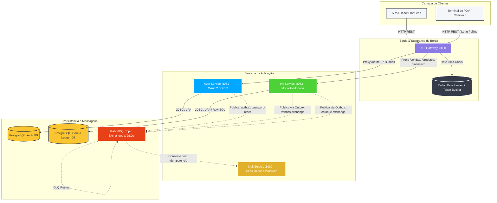
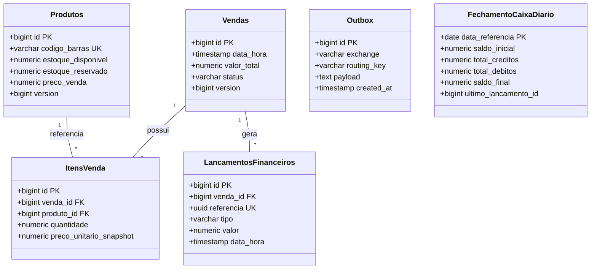

# 🏛️ Arquitetura do Sistema & Visão Geral (System Overview)

Este documento fornece a visão arquitetural consolidada do ecossistema **Pet Shop Microservices**, cobrindo o modelo C4 de containers, a matriz de comunicação entre serviços e o mapeamento de esquemas físicos de banco de dados (Flyway/JPA).

---

## 1. Diagrama C4 de Containers & Infraestrutura

---

## 2. Matriz de Comunicação entre Componentes

| Origem | Destino | Protocolo | Padrão / Semântica | Descrição |
| :--- | :--- | :--- | :--- | :--- |
| **Cliente / PDV** | **API Gateway** | HTTP/1.1 (JSON) | Síncrono / Long Polling | Requisições públicas, autenticação e espera não-bloqueante via `DeferredResult`. |
| **API Gateway** | **Auth Service** | HTTP/1.1 | Proxy Reverso / Stateless | Roteamento de rotas `/oauth2/**` e `/usuarios/**`. |
| **API Gateway** | **Inv Service** | HTTP/1.1 | Proxy Reverso / Stateless | Roteamento de rotas de catálogo, checkout e dashboards financeiros. |
| **Inv Service (Checkout)** | **Inv Service (Finance)** | Em Memória | Spring Events (`VendaPagaEvent`) | Publicação de `VendaPagaEvent` (`inv.shared.event`) consumida por `VendaPagaEventListener`. |
| **Inv Service (Worker)** | **RabbitMQ** | AMQP 0-9-1 | Polling Transacional (`SKIP LOCKED`) | Worker de Outbox lendo tabela `outbox` e postando em topic exchanges. |
| **Auth Service** | **RabbitMQ** | AMQP 0-9-1 | Push Assíncrono | Publicação direta de eventos de recuperação de senha (`PasswordResetMessage`). |
| **RabbitMQ** | **Mail Service** | AMQP 0-9-1 | Idempotent Consumer | Consumo de e-mails transacionais com deduplicação em `processed_events`. |

---

## 3. Mapeamento Físico de Banco de Dados & Migrations (Flyway)

A integridade do modelo de dados é gerenciada de forma estrita via scripts de migração do Flyway e tabelas de suporte do ecossistema Spring.

### A. Esquema do `inv-service` ([`V1__Schema_Inicial.sql`](../../apps/inv-service/src/main/resources/db/migration/V1__Schema_Inicial.sql))

| Tabela | Bounded Context | Finalidade Arquitetural |
| :--- | :--- | :--- |
| `produtos` | **Inventory** | Registro de catálogo e saldo atômico (`estoque_disponivel`, `estoque_reservado`). |
| `movimentacoes_estoque` | **Inventory** | Trilha histórica de auditoria de entradas, saídas e reservas. |
| `vendas` | **Checkout** | Agregado raiz de transação comercial e máquina de estados (`ABERTA`, `AGUARDANDO_PAGAMENTO`, `CONCLUIDA`, `CANCELADA`). |
| `itens_venda` | **Checkout** | Snapshots imutáveis de preço e produto no momento da compra. |
| `outbox` | **Shared** | Fila física de transações distribuídas para despacho AMQP sem 2PC. |
| `lancamentos_financeiros` | **Finance** | **Ledger Contábil Append-Only**; registros imutáveis com `referencia` UUID única. |
| `financial_projection_venda` | **Finance** | Tabela de leitura CQRS contendo saldos consolidados por venda. |
| `financial_projection_checkpoint` | **Finance** | Tabela de deduplicação e garantia *exactly-once* do pipeline CQRS. |
| `financial_reconciliation_checkpoint`| **Finance** | Marcação de *High Watermark* para reconciliação incremental. |
| `projection_retry_queue` | **Finance** | Fila de auto-cura para reprocessar falhas assíncronas com `SKIP LOCKED`. |
| `fechamento_caixa_diario` | **Finance** | Tabela de snapshots consolidados D+0 de fechamento diário. |

### B. Esquema do `auth-service` ([`V2__create_oauth_tables.sql`](../../apps/auth-service/src/main/resources/db/migration/V2__create_oauth_tables.sql))

| Tabela | Finalidade Arquitetural |
| :--- | :--- |
| `oauth2_registered_client` | Registro persistido de aplicações clientes (Front-end SPA, PDV Desktop, Mobile). |
| `oauth2_authorization` | Estado das sessões OAuth2, códigos de autorização emitidos e Refresh Tokens ativos. |
| `oauth2_authorization_consent` | Consentimentos de escopo concedidos pelos usuários. |
| `usuarios` | Base cadastral de credenciais com senhas criptografadas em BCrypt. |

### C. Esquema do `mail-service` (JPA Automático)

> [!NOTE]
> **Estratégia Mista de Migrações:** Enquanto o `inv-service` e o `auth-service` utilizam **Flyway** devido à criticidade de versionamento de regras de negócio, tabelas contábeis e especificações padrão OIDC, o `mail-service` utiliza gerenciamento automático de schema via **Hibernate (`ddl-auto=update`)**. Como o consumidor de e-mails atua como um worker assíncrono cuja única persistência é a tabela efêmera de deduplicação `processed_events` (sem constraints relacionais complexas), a criação direta via JPA reduz o overhead de manutenção de scripts manuais.

| Tabela | Finalidade Arquitetural |
| :--- | :--- |
| `processed_events` | Tabela de idempotência de eventos consumidos (`event_id` como PK) para proteção contra envio duplicado de e-mails. |

---

## 4. Rastreabilidade e Observabilidade Distribuída

* **Distributed Tracing:** Toda mensagem originada no sistema carrega um cabeçalho `eventId` / `correlationId` para rastreamento ponta a ponta no Grafana Loki.
* **Métricas em Tempo Real:** Endpoints `/actuator/prometheus` expostos em todas as aplicações com métricas customizadas de locks e execução de jobs.
* **Logs Não-Bloqueantes:** Utilização de `Logstash Async Appender` para evitar overhead de I/O de disco em threads HTTP de requisição.
