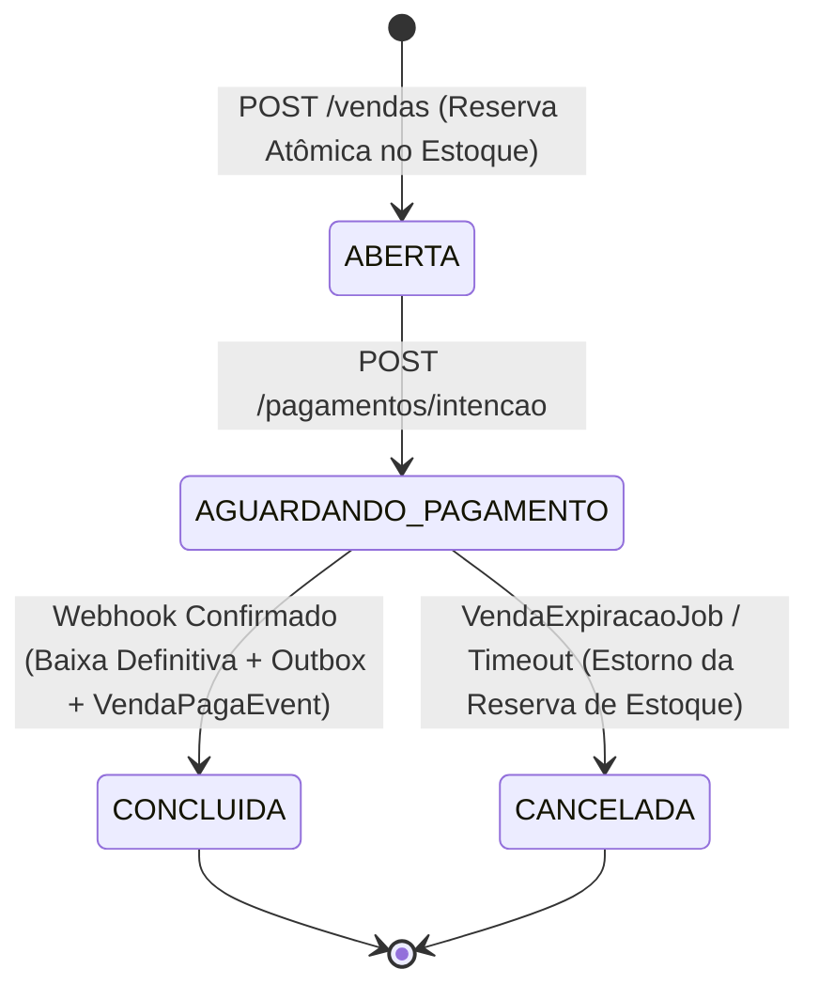
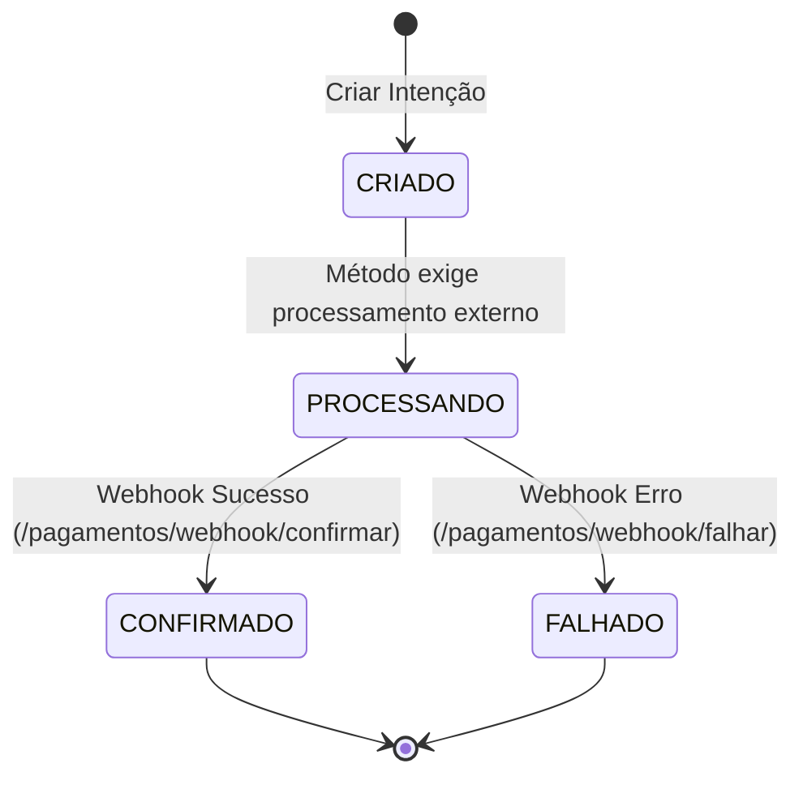
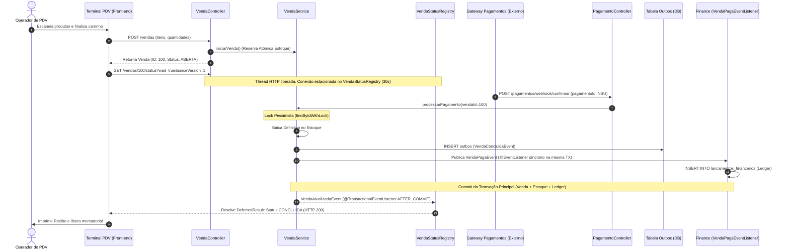

# 🛒 Bounded Context: Checkout (Vendas & Pagamentos)

O módulo **Checkout** é responsável pela orquestração do ciclo de vida das vendas, integração com gateways de pagamento, controle de concorrência na liquidação e notificação em tempo real para os caixas de PDV via **Long Polling Não-Bloqueante**.

---

## 1. Glossário da Linguagem Ubíqua (Ubiquitous Language)

| Termo | Definição no Domínio |
| :--- | :--- |
| **Venda** | Agregado raiz que representa o pedido comercial, contendo o valor total, status, versionamento otimista e a lista de itens comprados. |
| **Item de Venda** | Snapshot imutável do produto (preço unitário, quantidade e nome) no momento exato em que foi adicionado ao carrinho. |
| **Intenção de Pagamento** | Registro prévio de uma tentativa de pagamento associada a uma referência UUID externa e método de pagamento (Pix, Cartão, Dinheiro). |
| **Recibo** | Projeção formatada de uma venda ativa ou concluída, contendo a lista de itens, subtotais e dados de abertura. |
| **Long Polling (`DeferredResult`)** | Mecanismo de espera reativa assíncrona onde o terminal de PDV aguarda até 30 segundos por uma mudança de estado da venda sem prender threads do servidor. |
| **Venda Expirada** | Venda que permaneceu em `AGUARDANDO_PAGAMENTO` além do tempo limite configurado e tem seus itens devolvidos automaticamente ao estoque disponível por um job agendado. |

---

## 2. Máquinas de Estados do Domínio

### A. Ciclo de Vida da Venda (`StatusVenda`)

### B. Ciclo de Vida do Pagamento (`StatusPagamento`)

---

## 3. Diagramas de Sequência e Fluxos do Domínio

### Fluxo Completo: Abertura, Long Polling de PDV, Webhook e Conclusão

---

## 4. Rotinas Periódicas de Expiração (Housekeeping)

O componente [`VendaExpiracaoJob`](../../apps/inv-service/src/main/java/inv/checkout/infrastructure/jobs/VendaExpiracaoJob.java) roda periodicamente a cada 5 minutos:
1. Localiza vendas em `StatusVenda.AGUARDANDO_PAGAMENTO` criadas há mais de 30 minutos.
2. Executa `vendaService.cancelarVendaExpirada(vendaId)` sob lock pessimista.
3. Invoca `estoqueService.estornarReservaEstoque()`, devolvendo as unidades reservadas para `estoque_disponivel` sem intervenção manual.

---

## 5. ADRs Vinculados a Este Domínio

* 📑 **[ADR-0002: Controle Híbrido de Concorrência e Estoque Atômico](../adr/0002-atomic-sql-inventory-and-hybrid-locking.md)**
* 📑 **[ADR-0003: Long Polling Não-Bloqueante com DeferredResult](../adr/0003-async-long-polling-pos-deferred-result.md)**
* 📑 **[ADR-0004: Transactional Outbox Pattern com SKIP LOCKED](../adr/0004-transactional-outbox-with-skip-locked.md)**
