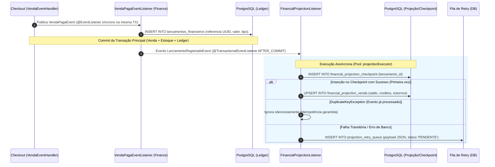
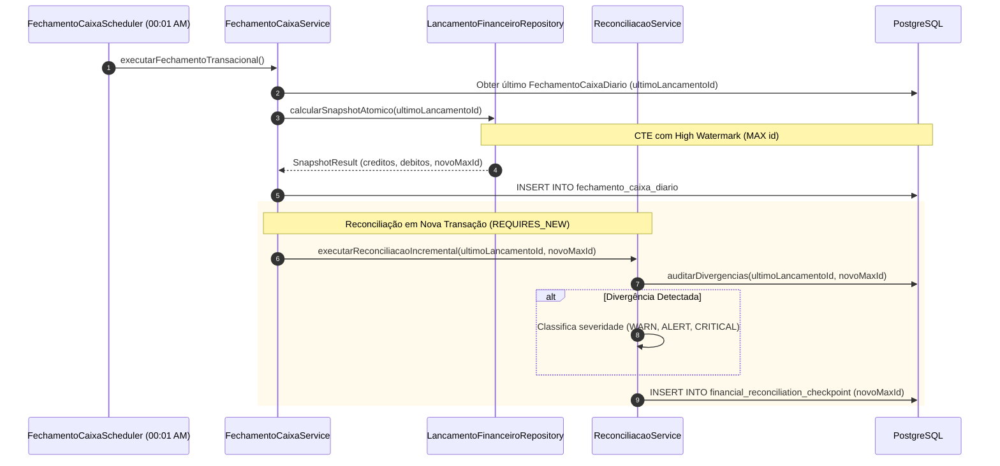
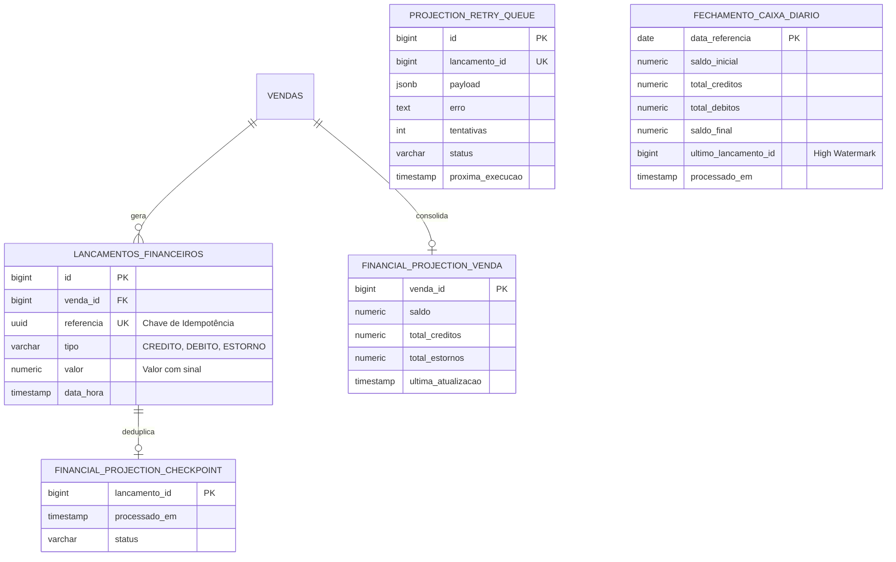

# 💰 Bounded Context: Finance (Motor Contábil & Financeiro)

O módulo **Finance** é o núcleo contábil do sistema. Ele é projetado sob os princípios de **Imutabilidade (Ledger Append-Only)**, **Deduplicação Idempotente**, **CQRS Assíncrono com Auto-Cura** e **Consolidação Incremental via High Watermark**.

---

## 1. Glossário da Linguagem Ubíqua (Ubiquitous Language)

| Termo | Definição no Domínio |
| :--- | :--- |
| **Lançamento Financeiro** | Registro atômico e imutável de uma movimentação monetária vinculada a uma venda. Não sofre edição ou exclusão. |
| **Ledger (Livro-Razão)** | Conjunto sequencial e histórico de todos os lançamentos financeiros do sistema (`lancamentos_financeiros`). |
| **Referência UUID** | Identificador único universal gerado na intenção de pagamento, utilizado como chave de idempotência física. |
| **Projeção CQRS** | Visão pré-calculada e desnormalizada do saldo de uma venda (`financial_projection_venda`), otimizada para leitura instantânea $O(1)$. |
| **Checkpoint CQRS** | Tabela de controle (`financial_projection_checkpoint`) que garante que um lançamento específico seja projetado exatamente uma vez (*exactly-once*). |
| **High Watermark** | Identificador máximo (`id`) de lançamento financeiro processado até determinado ponto no tempo, usado como marco delimitador. |
| **Fechamento D+0** | Snapshot consolidado diário contendo saldo inicial, créditos, débitos e saldo final até determinado High Watermark. |
| **Reconciliação $O(\Delta)$** | Auditoria incremental que compara o saldo real no Ledger com o saldo projetado no CQRS apenas para as vendas modificadas no período. |

---

## 2. Diagramas de Sequência e Fluxos do Domínio

### A. Fluxo de Registro de Lançamento e Projeção CQRS Assíncrona

### B. Ciclo de Fechamento Diário D+0 e Reconciliação Incremental

---

## 3. Modelo Físico de Tabelas do Domínio Financeiro

---

## 4. Matriz de Resiliência e Tratamento de Erros

| Cenário de Falha | Mecanismo de Defesa | Efeito no Sistema |
| :--- | :--- | :--- |
| **Reenvio de Webhook Duplicado** | `UK (referencia)` no Ledger | Rejeição atômica no banco sem duplicar lançamento. |
| **Crash do servidor antes da projeção CQRS** | Evento não executado | O Ledger permanece intacto; a reconciliação noturna sinaliza divergência ou a fila de retry reprocessa. |
| **Lock temporário durante Upsert CQRS** | `catch (Exception)` no Listener | Payload serializado na `projection_retry_queue` e reprocessado pelo `ProjectionRetryScheduler`. |
| **Divergência de Saldo Real vs Projetado** | `ReconciliacaoService` $O(\Delta)$ | Alerta classificado automaticamente: \(\le 0,01\) (Warn), \(\le 1,00\) (Alert), \(> 1,00\) (Critical). |

---

## 5. ADRs Vinculados a Este Domínio

* 📑 **[ADR-0005: Ledger Financeiro Imutável (Append-Only) com UUID](../adr/0005-append-only-financial-ledger-and-idempotency.md)**
* 📑 **[ADR-0006: Projeções CQRS Assíncronas e Auto-Cura via SKIP LOCKED](../adr/0006-cqrs-asynchronous-projections-and-self-healing-retry.md)**
* 📑 **[ADR-0007: Fechamento de Caixa D+0 com High Watermark](../adr/0007-d0-daily-cash-closing-and-high-watermark.md)**
