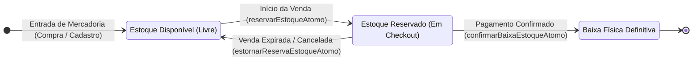
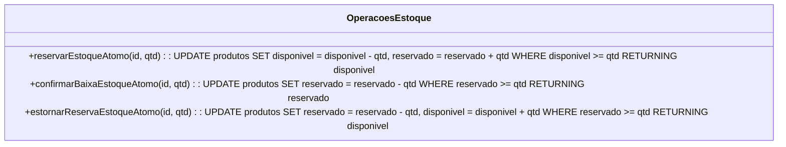
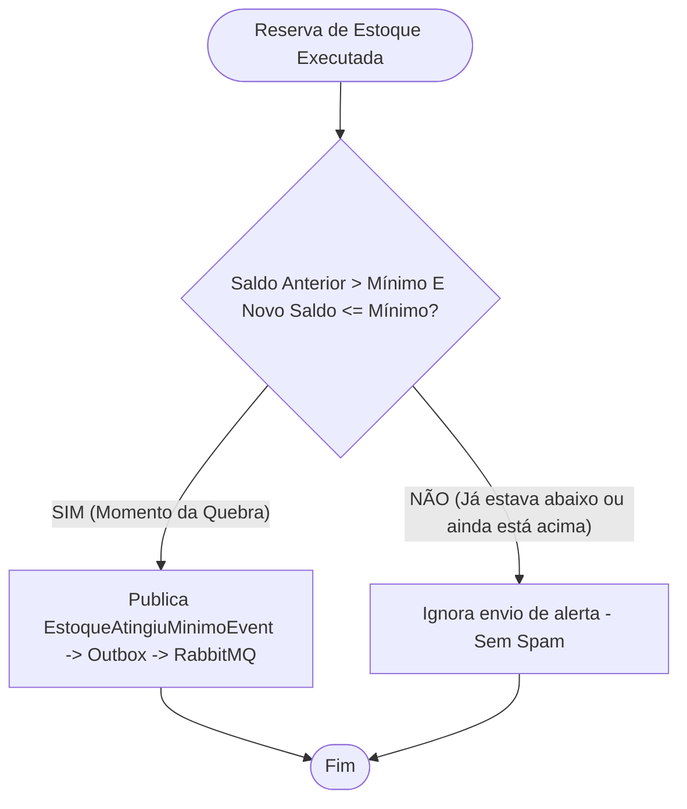
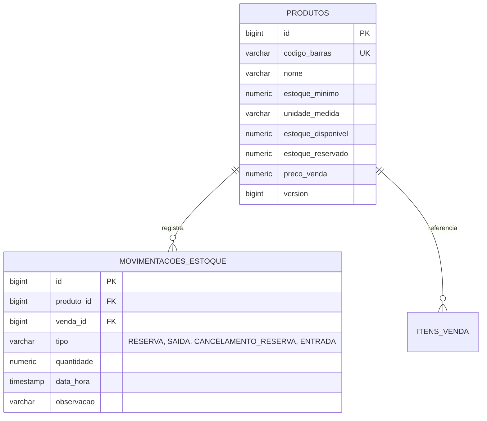

# 📦 Bounded Context: Inventory (Controle de Estoque & Catálogo)

O módulo **Inventory** é responsável pelo catálogo de produtos, rastreabilidade física de mercadorias, prevenção de *overselling* (vendas a descoberto) via **SQL Atômico** e alertas de estoque baixo orientados a eventos com proteção anti-spam.

---

## 1. Glossário da Linguagem Ubíqua (Ubiquitous Language)

| Termo | Definição no Domínio |
| :--- | :--- |
| **Produto** | Entidade de catálogo com identificação por código de barras, unidade de medida, preço e regras de estoque. |
| **Estoque Disponível** | Quantidade física de produto livre para novas compras nos caixas de PDV. |
| **Estoque Reservado** | Quantidade alocada para vendas em andamento que ainda aguardam liquidação de pagamento. |
| **Estoque Mínimo** | Ponto de reposição (*Reorder Point*); limiar crítico que dispara alertas automáticos para compras/administração. |
| **Movimentação de Estoque** | Registro de auditoria (`movimentacoes_estoque`) com tipo (`RESERVA`, `SAIDA`, `CANCELAMENTO_RESERVA`, `ENTRADA`, `AJUSTE`) e timestamp. |
| **Transição de Limiar (Anti-Spam)** | Regra que dispara o evento de alerta apenas quando o saldo cruza o limite mínimo pela primeira vez (\(Antes > Minimo\) e \(Depois \le Minimo\)), evitando spams de e-mail em vendas subsequentes. |

---

## 2. Ciclo de Vida do Estoque e Operações Atômicas

### Comportamento das Queries SQL Nativas ([`ProdutoRepository.java`](../../apps/inv-service/src/main/java/inv/inventory/infrastructure/persistence/ProdutoRepository.java#L27-L50))

---

## 3. Lógica de Alerta Anti-Spam para Estoque Baixo

Para evitar que múltiplos caixas vendendo o mesmo produto disparem dezenas de e-mails para o administrador quando o estoque já está abaixo do mínimo, o [`EstoqueService`](../../apps/inv-service/src/main/java/inv/inventory/usecase/EstoqueService.java#L93-L105) aplica uma **verificação de transição de estado**:

---

## 4. Modelo Físico de Dados

---

## 5. ADRs Vinculados a Este Domínio

* 📑 **[ADR-0002: Controle Híbrido de Concorrência e Estoque Atômico](../adr/0002-atomic-sql-inventory-and-hybrid-locking.md)**
* 📑 **[ADR-0004: Transactional Outbox Pattern com SKIP LOCKED](../adr/0004-transactional-outbox-with-skip-locked.md)**
* 📑 **[ADR-0008: Consumidor Idempotente e Evolução de Schemas](../adr/0008-distributed-idempotent-consumer-and-schema-evolution.md)**
