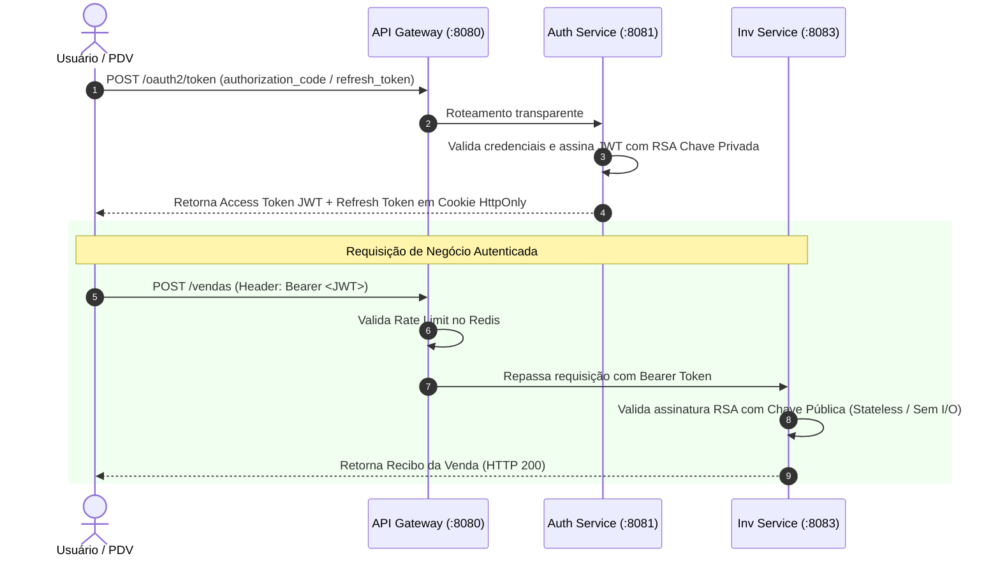

# 🔐 Bounded Context: Security & Identity (Autenticação, OIDC & Gateway)

O domínio de **Security & Identity** estabelece o padrão de segurança corporativa do sistema através do **Spring Authorization Server (OpenID Connect 1.0)**, validação criptográfica assimétrica (**RSA 2048-bit**) e proteção de borda com **Rate Limiting via Redis** no API Gateway.

---

## 1. Arquitetura de Segurança & Fluxo OIDC



---

## 2. API Gateway & Proteção de Borda

O **API Gateway** (`apps/api-gateway`) é a única porta de entrada exposta publicamente para os clientes:

### A. Rate Limiting com Redis ([`RateLimitConfig.java`](../../apps/api-gateway/src/main/java/gateway/config/RateLimitConfig.java))
* **Algoritmo:** *Token Bucket* implementado nativamente pelo Spring Cloud Gateway e Redis.
* **Key Resolver:** Extração do IP remoto do cliente ou identificador de usuário para contenção de ataques de força bruta e Denial of Service (DoS).

### B. Mapeamento de Rotas
* `/oauth2/**` e `/usuarios/**` $\rightarrow$ Encaminhados para o `auth-service:8081`.
* `/vendas/**`, `/produtos/**`, `/movimentacoes/**` $\rightarrow$ Encaminhados para o `inv-service:8083`.
* `/swagger-ui/**`, `/v3/api-docs/**` $\rightarrow$ Documentação agregada OpenAPI.

---

## 3. Estrutura do JWT e Claims Customizadas

O payload do Access Token carrega os dados de identidade para que os Resource Servers downstream tomem decisões de autorização (`@PreAuthorize`) de forma totalmente autônoma:

```json
{
  "iss": "http://auth-service:8081",
  "sub": "admin@petshop.com",
  "user_id": 1,
  "name": "Administrador Principal",
  "email": "admin@petshop.com",
  "roles": [
    "ADMIN",
    "OPERADOR"
  ],
  "exp": 1724851200,
  "iat": 1724847600
}
```

---

## 4. Gerenciamento Seguro de Refresh Tokens

Para mitigar riscos de roubo de sessão em navegadores:
* O Refresh Token é transportado exclusivamente através de cookies com flag **`HttpOnly`** e política de **`SameSite`** configurável (`Lax` em DEV / `Strict` em PROD).
* Filtros dedicados ([`RefreshTokenCookieFilter.java`](../../apps/auth-service/src/main/java/auth/security/filter/RefreshTokenCookieFilter.java) e [`CookieRefreshTokenRequestFilter.java`](../../apps/auth-service/src/main/java/auth/security/filter/CookieRefreshTokenRequestFilter.java)) interceptam a renovação de sessão de forma transparente para o Front-end.

---

## 5. ADRs Vinculados a Este Domínio

* 📑 **[ADR-0009: Arquitetura de Autenticação com Spring Authorization Server e RSA](../adr/0009-centralized-oauth2-oidc-and-stateless-resource-servers.md)**
